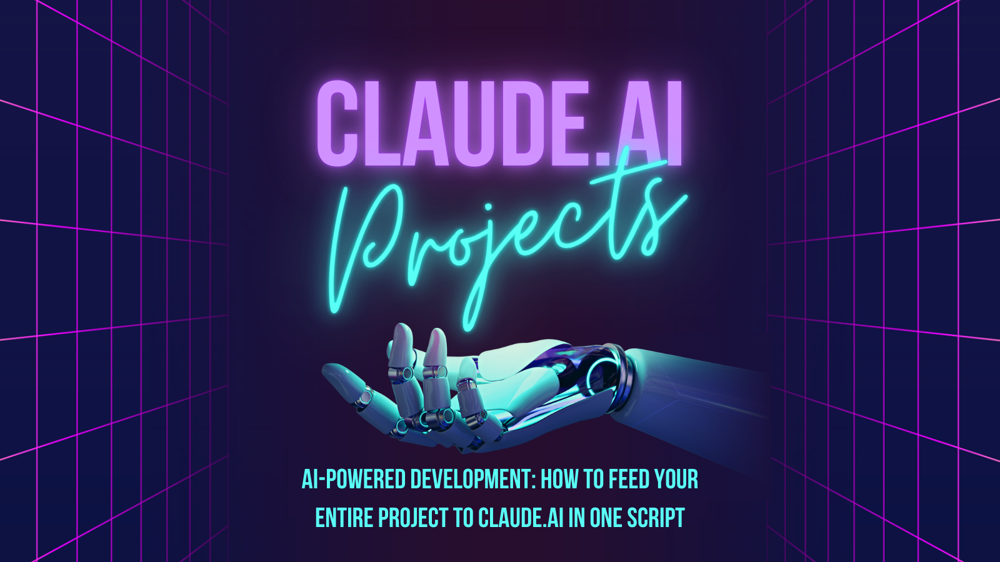

# 🤖 Claude-Context-Copier

Welcome to the Claude-Context-Copier repo! 👋 This is your one-stop shop for supercharging your AI-assisted development with Claude.ai.

## What's This All About?

Ever wished you could just dump your entire project into Claude's brain? Well, now you can! 🧠💻

This repo contains a collection of bash scripts designed to copy your project files and structure in a way that's perfect for uploading to Claude.ai's project context feature. It's like giving Claude a VIP tour of your codebase!

## 🌟 Features

- Supports multiple frameworks (Astro, SvelteKit, Next.js, Nuxt.js, and Python projects)
- Intelligently copies relevant files while ignoring the junk (bye-bye, node_modules!)
- Creates a neat project structure file for that extra context goodness
- Easily customizable to fit your specific project needs

## 🚀 Getting Started

1. Clone this repo (or just copy the script you need)
2. Place the script in your project's root directory
3. Run it: `bash script_name.sh`
4. Upload the contents of the newly created `copy` directory to Claude.ai
5. Start chatting with your new, project-aware AI buddy!

## 🛠️ Available Scripts

- `copy-files-astro.sh`: For Astro + Svelte projects
- `copy-files-sveltekit.sh`: For SvelteKit projects
- `copy-files-next.sh`: For Next.js projects (v14+ with app router)
- `copy-files-nuxt.sh`: For Nuxt.js projects
- `copy-files-python.sh`: For Python projects

## 🎨 Customization

Feel like tinkering? Check out the "Expanding Your Options" section in each script for cool modifications you can make!

## 📚 Learn More

Want to dive deeper into how this all works? Check out my article [AI-Powered Development: How to Feed Your Entire Project to Claude.ai in One Script](https://meirjc.hashnode.dev/ai-powered-development-how-to-feed-your-entire-project-to-claudeai-in-one-script).

## 🤝 Contributing

Got ideas for improvements? Found a bug? Feel free to open an issue or submit a PR. Let's make this tool awesome together!

## 📜 License

This project is open source and available under the [MIT License](LICENSE).

## 🙌 Connect with Me

I'm Meir J Cohen, a full-stack web developer passionate about AI and productivity. Let's connect!

- GitHub: [@MeirJC](https://github.com/MeirJC)
- Hashnode: [@MeirJC](https://hashnode.com/@MeirJC)

Happy coding, and may your bugs be ever in your favor! 🐛✨
